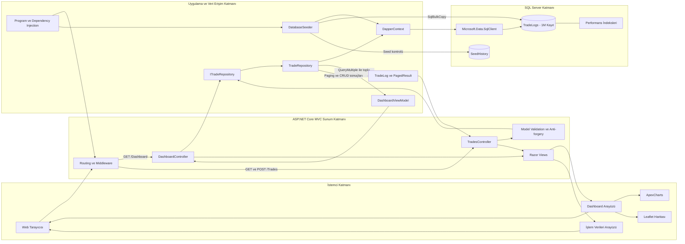

# TradePulse

TradePulse; kripto para işlem verilerini analiz etmek ve yönetmek için geliştirilmiş, **ASP.NET Core MVC**, **Dapper** ve **SQL Server** tabanlı bir Big Data dashboard uygulamasıdır. Proje, varsayılan kurulumda üretilen **1.000.000 anlamlı işlem kaydı** üzerinde istatistik üretme, görselleştirme, sunucu taraflı sayfalama ve CRUD operasyonlarını yüksek performansla gerçekleştirme yaklaşımını gösterir.

## Öne Çıkan Özellikler

- Toplam işlem hacmi, komisyon, en yüksek hacimli parite ve ortalama işlem süresi istatistikleri
- Veri setinin son 30 gününe ait hacim trendi ve önceki dönem karşılaştırmaları
- Parite ve alış/satış dağılımlarını gösteren interaktif ApexCharts grafikleri
- Ülke bazlı işlem yoğunluklarını gösteren Leaflet dünya haritası
- En yüksek hacimli işlemler için hızlı özet tablosu
- 1 milyon kayıt üzerinde SQL Server tarafında çalışan sayfalama
- Birincil anahtar üzerinden ID bazlı hızlı kayıt sorgulama
- Doğrulamalı güncelleme ve onay ekranına sahip silme işlemleri
- Dapper parametreleri ve anti-forgery token ile güvenli veri işlemleri
- İlk çalıştırmada otomatik veritabanı, şema, indeks ve veri seti oluşturma
- Masaüstü, tablet ve mobil ekranlara uyumlu responsive arayüz

## Kullanılan Teknolojiler

| Katman | Teknoloji |
|---|---|
| Backend | .NET 10, ASP.NET Core MVC, C# |
| Veri erişimi | Dapper 2.1, Microsoft.Data.SqlClient |
| Veritabanı | Microsoft SQL Server |
| Büyük veri yükleme | SqlBulkCopy |
| Arayüz | Razor Views, Bootstrap, özel CSS |
| Grafikler | ApexCharts |
| Harita | Leaflet, Carto basemap |
| İstemci tarafı | Vanilla JavaScript |

## Proje Mimarisi ve Veri Akışı

Uygulama; sunum, uygulama/veri erişimi ve veritabanı sorumluluklarını birbirinden ayıran katmanlı bir yapı kullanır. Controller sınıfları HTTP akışını yönetirken bütün SQL işlemleri repository üzerinden gerçekleştirilir.



```

## Veri Seti

Veri seti, 85.000 kullanıcı kodundan seçilen kripto para alım ve satım işlemlerini temsil eder.

| Alan | Açıklama |
|---|---|
| `Id` | Benzersiz işlem kimliği |
| `UserCode` | `USR-000001` formatında kullanıcı kodu |
| `CryptoPair` | BTC, ETH, BNB, SOL, XRP, ADA, AVAX veya DOGE / USDT paritesi |
| `TradeType` | BUY veya SELL işlem yönü |
| `Price` | İşlem anındaki birim fiyat |
| `Quantity` | Alınan veya satılan varlık miktarı |
| `TotalUSD` | Fiyat ve miktardan hesaplanan işlem toplamı |
| `FeeUSD` | İşlem toplamından hesaplanan komisyon |
| `LocationCountry` | İşlemin gerçekleştiği ülke |
| `ExecutionTimeMs` | Milisaniye cinsinden işlem süresi |
| `TransactionDate` | UTC işlem tarihi |

Veriler sabit bir random seed ile anlamlı fiyat aralıklarında üretilir. `TotalUSD` ve `FeeUSD` alanları diğer finansal alanlardan hesaplandığı için kayıtlar kendi içinde tutarlıdır.

## Performans Yaklaşımı

- **Toplu yükleme:** 1 milyon kayıt, tek tek `INSERT` yerine `SqlBulkCopy` ile yüklenir.
- **Partili üretim:** Bellek kullanımını kontrol altında tutmak için 50.000 satırlık partiler kullanılır.
- **Sunucu taraflı paging:** Uygulama yalnızca ekranda gösterilecek 20 veya 50 kaydı SQL Server'dan alır.
- **Tek bağlantıda dashboard:** Bağımsız dashboard sorguları `QueryMultiple()` ile tek round-trip içinde çalıştırılır.
- **Parametreli sorgular:** Bütün filtre ve CRUD değerleri Dapper parametreleriyle SQL Server'a gönderilir.
- **İndeksler:** Tarih, parite, işlem türü, toplam tutar ve ülke sorguları için covering index yapıları bulunur.
- **Asenkron I/O:** Veritabanı operasyonları async olarak çalışır ve `CancellationToken` destekler.

## Proje Yapısı

```text
DapperProject/
├── Context/
│   └── DapperContext.cs          # SQL bağlantılarının oluşturulması
├── Controllers/
│   ├── DashboardController.cs    # Dashboard HTTP akışı
│   ├── TradesController.cs       # Paging, ID sorgusu ve CRUD akışı
│   └── HomeController.cs         # Ana yönlendirme ve hata sayfası
├── Data/
│   └── DatabaseSeeder.cs         # Şema ve 1 milyon kayıt üretimi
├── Database/Scripts/
│   └── TradePulse.sql            # Bağımsız, idempotent SQL şeması
├── Models/
│   ├── DashboardViewModel.cs     # Dashboard sonuç modelleri
│   ├── PagedResult.cs            # Sayfalama modeli
│   └── TradeLog.cs               # İşlem ve doğrulama modeli
├── Services/
│   ├── ITradeRepository.cs       # Veri erişim sözleşmesi
│   └── TradeRepository.cs        # Dapper sorguları ve CRUD işlemleri
├── Views/
│   ├── Dashboard/                # Dashboard Razor görünümü
│   ├── Trades/                   # Veri tablosu ve düzenleme arayüzü
│   └── Shared/                   # Ortak layout ve hata görünümü
├── wwwroot/
│   ├── css/                      # Responsive uygulama tasarımı
│   └── js/                       # Dashboard, tablo ve ortak etkileşimler
├── appsettings.json              # Bağlantı ve seed ayarları
└── Program.cs                    # DI, middleware ve başlangıç akışı
```

## Uygulama Rotaları

| Metot | Rota | Açıklama |
|---|---|---|
| GET | `/` | Dashboard sayfasına yönlendirir |
| GET | `/Dashboard` | Analiz dashboard'unu getirir |
| GET | `/Trades` | Sayfalanmış işlem tablosunu getirir |
| GET | `/Trades/{id}` | ID'ye göre işlem detayını JSON olarak getirir |
| POST | `/Trades/Update` | Bir işlem kaydını doğrulayıp günceller |
| POST | `/Trades/Delete/{id}` | Bir işlem kaydını siler |

## Teknik Kazanımlar

Bu proje aşağıdaki konularda uygulamalı örnek sunar:

- Dapper ile repository pattern kullanımı
- Büyük veri setlerinin verimli biçimde oluşturulması ve yüklenmesi
- SQL Server sorgu ve indeks tasarımı
- Server-side paging ve birincil anahtar sorguları
- Birden fazla sonuç setinin tek sorguda işlenmesi
- ASP.NET Core MVC model binding ve validation
- Razor ile backend verisinin JavaScript grafiklerine aktarılması
- Responsive dashboard ve veri yönetimi arayüzü geliştirme

---

